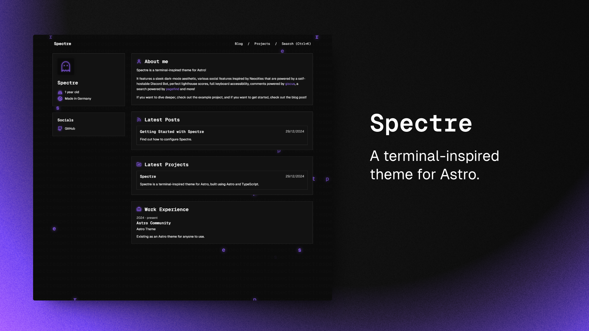

# Ryan Jordan - Portfolio & Blog



This is my personal portfolio website and blog, built with [Astro](https://astro.build) and powered by the [Spectre](https://github.com/louisescher/spectre) theme.

## 🚀 Live Site

Visit my portfolio at: **[ryanjordan.dev](https://ryanjordan.dev)**

## 🛠️ Tech Stack

- **Framework**: [Astro](https://astro.build) with Node.js adapter
- **Theme**: [Spectre](https://github.com/louisescher/spectre) by [Louise Scher](https://github.com/louisescher)
- **Styling**: Custom CSS with terminal-inspired design
- **Content**: Markdown/MDX for blog posts and projects
- **Search**: [Pagefind](https://pagefind.app) for site search
- **Deployment**: Docker containerized deployment via GitHub Actions

## 📝 About This Site

This portfolio showcases my work, thoughts, and experiences in software development. It includes:

- **Portfolio**: Featured projects and work experience
- **Blog**: Technical articles, tutorials, and insights
- **About**: Information about my background and skills
- **Contact**: Direct email contact for collaboration opportunities

## 🎨 Spectre Theme

This site is built using the **Spectre** theme, a terminal-inspired theme for Astro created by [Louise Scher](https://github.com/louisescher).

### Spectre Features

- 100 / 100 Lighthouse performance
- Responsive for all screen sizes
- Fully accessible
- Type-Safe
- Auto-generated sitemap
- Markdown / MDX Support
- Builds on content collections
- Search powered by [pagefind](https://pagefind.app)
- Comments powered by [giscus](https://giscus.app) (can be turned off)

### Getting Started with Spectre

If you want to create your own site with the Spectre theme:

[](https://stackblitz.com/github/louisescher/spectre/tree/main)
[](https://codesandbox.io/p/sandbox/github/louisescher/spectre/tree/main)

Alternatively, you can create a new Astro project with Spectre like this:

```bash
# yarn
yarn create astro@latest -- --template louisescher/spectre

# pnpm
pnpm create astro@latest --template louisescher/spectre

# yarn
yarn create astro --template louisescher/spectre
```

## 🚀 Development

### Local Development

```bash
# Install dependencies
npm install

# Start development server
npm run dev

# Build for production
npm run build

# Preview production build
npm run preview
```

### Docker Development

```bash
# Build Docker image
docker build -t ryanjordan-portfolio .

# Run locally
docker run -p 3000:3000 ryanjordan-portfolio
```

## 📚 Spectre Integration

If you want to know more about how the custom integration that is used in the `astro.config.ts` file works, head over to the [integration's own README](https://github.com/louisescher/spectre/tree/master/package)!

## 🙏 Credits

- **Theme**: [Spectre](https://github.com/louisescher/spectre) by [Louise Scher](https://github.com/louisescher)
- **Framework**: [Astro](https://astro.build)
- **Search**: [Pagefind](https://pagefind.app)
- **Comments**: [Giscus](https://giscus.app)

---

**Curious about the original Spectre theme?** Head over to [the preview page](https://spectre.lou.gg) to find out more!
