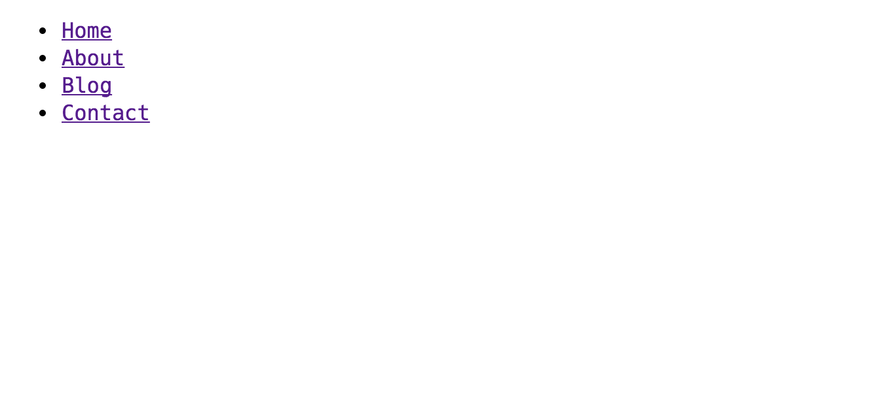
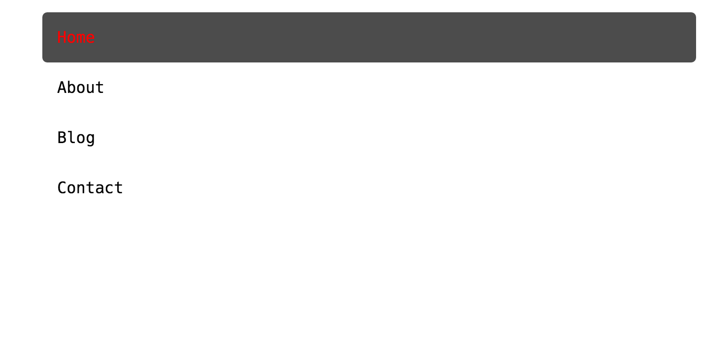
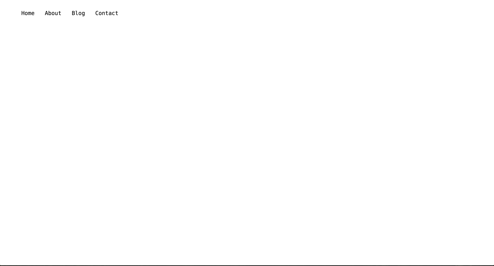
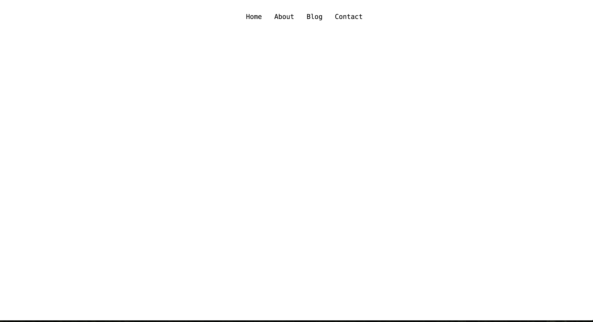

So, now that I work with a team of web developers, I am constantly learning new things. One of the many new things I've learned about, is flexbox. I have to admit, I found it very intimidating at first. I figured I'd make a small tutorial about flexbox using a very simple navigation menu.

Flexbox makes things easier, especially when it comes to centering items. One of the main reasons I use [Bootstrap](http://getbootstrap.com) in the majority of my projects is due to it being a pain to layout items and get them centered. Using frameworks like [Bootstrap](http://getbootstrap.com) and [Foundation](http://foundation.zurb.com) help you get up and running quickly. However, most developers (I've been guilty of this) don't go back and remove the unused CSS or use a CDN where most users will have the file cached, but for those who don't, well it could take a bit more time to load.

<!--more-->

With a few lines of CSS, we can get a very simple navigation menu centered and listed horizontally. For this example, I'll just use an unordered list.

```html
<body>
	<ul>
		<li><a href="#">Home</a></li>
		<li><a href="#">About</a></li>
		<li><a href="#">Blog</a></li>
		<li><a href="#">Contact</a></li>
	</ul>
</body>
```



We'll add a bit of styling to make our page look a bit more presentable.

```css
li {
	list-style: none;
	padding: 15px;
}

li:hover {
	color: red;
	background-color: rgba(0, 0, 0, 0.7);
	border-radius: 5px;
	cursor: pointer;
}

a {
	text-decoration: none;
	color: inherit;
}
```



Alright, now it's starting to look like a navigation menu. Now we just need to add <code class="language-css">display: flex;</code> to the container of the items we want to center. In this case, it's the <code class="language-html">\<ul\></code> .



The default value for <code class="language-css">flex-direction: row;</code> ,which just so happens to be what we need. Now we need to add <code class="language-css">justify-content: center;</code> and we're done.



The complete CSS file looks like:

```css
ul {
	display: flex;
	justify-content: center;
}

li {
	list-style: none;
	padding: 15px;
}

li:hover {
	color: red;
	background-color: rgba(0, 0, 0, 0.7);
	border-radius: 5px;
	cursor: pointer;
}

a {
	text-decoration: none;
	color: inherit;
}
```

Check out the [codepen](http://codepen.io/krjordan/pen/pjgqZZ/?editors=110)

Flexbox offers a lot more than just giving us the ability to quickly center elements. I plan on writing a few more posts on the topic, but you should check out two great resources I've found. CSS-Tricks has a great post on it called [A Complete Guide to Flexbox](https://css-tricks.com/snippets/css/a-guide-to-flexbox/) that I refer to quite frequently and Wes Bos has some awesome free [video tutorials](http://flexbox.io/) to help get you started.
