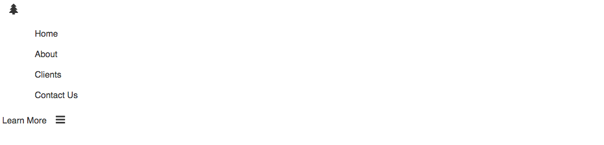
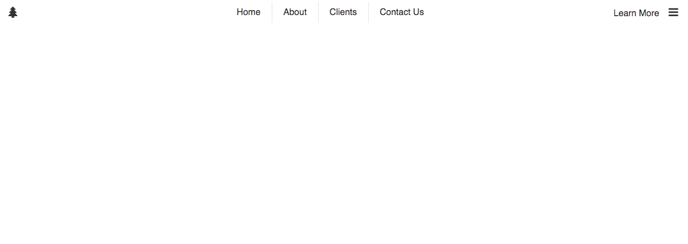

I decided to continue with the small flexbox tutorials. So here is another one. In this tutorial, we will make a navigation header using flexbox. If you haven't read my first post on flexbox, you should check it out [here](http://mycodingblog.com/discovering-flexbox/). I have made a [codepen](http://codepen.io/krjordan/pen/PPppOd/) of what we will be building. Let's get started with the HTML.

<!--more-->

```html
<body>
	<div id="header">
		<a href="#">
			<i class="fa fa-tree"></i>
		</a>
		<nav role="navigation">
			<ul>
				<li><a href="#">Home</a></li>
				<li><a href="#">About</a></li>
				<li><a href="#">Clients</a></li>
				<li><a href="#">Contact Us</a></li>
			</ul>
		</nav>
		<a href="#"
			>Learn More
			<i class="fa fa-bars"></i>
		</a>
	</div>
</body>
```

Nothing new here, it is a very simple navbar using some icons from [Font Awesome](https://fortawesome.github.io/Font-Awesome/get-started/). I'll style it up a bit so we can get to the point. I'm using [SASS](http://sass-lang.com/), so if you are still using regular CSS you should switch! If you are just starting out, check out the [codepen](http://codepen.io/krjordan/pen/PPppOd/) and click the <code class="bash">view compiled</code> button to view the regular CSS. This will also show you all of the prefixers too (<code class="language-css">-webkit-</code>, <code class="language-css">-moz</code>, etc.).

```css
#header {
	height: 2.5em;
	color: #333;
	a {
		text-decoration: none;
		color: #333;
		&:hover {
			color: lighten(#333, 30%);
		}
	}
	i {
		padding: 0 0.625em;
		font-size: 1.25em;
		&:hover {
			color: lighten(#333, 30%);
		}
	}
	nav {
		ul {
			li {
				list-style-type: none;
				padding: 0.625em 1.25em;
				border-right: 1px solid #e5e5e5;
				&:last-of-type {
					border: none;
				}
			}
		}
	}
}
```

So this will give us:


### Adding Flexbox

So lets add some flexbox. We'll start off by adding <code class="language-css">display: flex;</code>, <code class="language-css">align-items: center;</code> and <code class="language-css">justify-content: center;</code> to the <code class="language-css">div#header</code>, like so:

```css
#header {
	display: flex;
	align-items: center;
	justify-content: center;
	...;
}
```


This centers the content inside the header. **Note:** the <code class="language-html">\<ul\></code> is pushing the tree icon to the left. No need to concern ourselves with that. Now lets style the <code class="language-html">\<ul\></code> to <code class="language-css">display: flex;</code>, <code class="language-css">align-items: center;</code> and <code class="language-css">justify-content</code>. For the sake of this tutorial, and because I hate incomplete tutorials that skip over certain sections and assume the reader knows what they don't know...

```css
... nav {
  ul {
    display: flex;
    align-items: center;
    justify-content: center;
    li {
      ...;
```


Alright, so we are almost there! We now have our navbar and unordered list centered. Now we just need to figure out a way to push the tree icon to the left and the "Learn More" and menu icon to the right. We could do something crazy like mess with the width of the <code class="language-html">\<nav\></code> or use padding or margin. I dare say we could even use <code class="language-css">position: absolute;</code>, but **NO!!** There is a better solution. Let's look at <code class="language-css">flex-grow: 1;</code>.

<code class="language-css">flex-grow</code> is defined by [CSS-Tricks](https://css-tricks.com/snippets/css/a-guide-to-flexbox/) as

> The ability for a flex item to grow if necessary. It accepts a unitless value that serves as a proportion. It dictates what amount of the available space inside the flex container item should take up.

I personally use the <code class="language-css">flex</code> shorthand property since it only requires one parameter, <code class="language-css">flex-grow</code>. It will accomplish the same goal. So we will add <code class="language-css">flex: 1;</code> to our <code class="language-html">\<nav\></code> element. Like so:

```css
...

nav {
  flex: 1;
  ul {
    display: flex;
    align-items: center;
    ...
```

Our header will now be complete.


So without using excessive padding, margin, absolute positioning or a framework we have built a simple navigation header. It isn't mobile friendly, but works well on medium and up views. We would need to do a bit more to make it responsive.

That's all for now. The complete SASS file is written below or, once again, you can check out the [codepen](http://codepen.io/krjordan/pen/PPppOd) for the demo and code. If you have any questions or anything to add, be sure to leave a comment below. You can also reach me on Twitter at [@ryanjordandev](https://twitter.com/ryanjordandev).

```css
#header {
	display: flex;
	align-items: center;
	justify-content: center;
	height: 2.5em;
	color: #333;
	a {
		text-decoration: none;
		color: #333;
		&:hover {
			color: lighten(#333, 30%);
		}
	}
	i {
		padding: 0 0.625em;
		font-size: 1.25em;
		&:hover {
			color: lighten(#333, 30%);
		}
	}
	nav {
		flex: 1;
		ul {
			display: flex;
			align-items: center;
			justify-content: center;
			li {
				list-style-type: none;
				padding: 0.625em 1.25em;
				border-right: 1px solid #e5e5e5;
				&:last-of-type {
					border: none;
				}
			}
		}
	}
}
```
