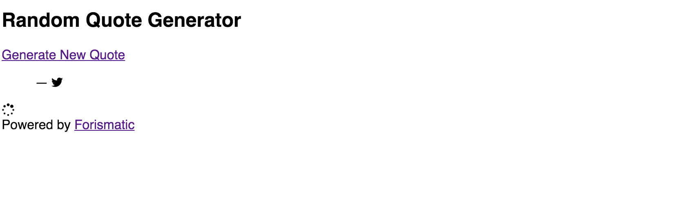
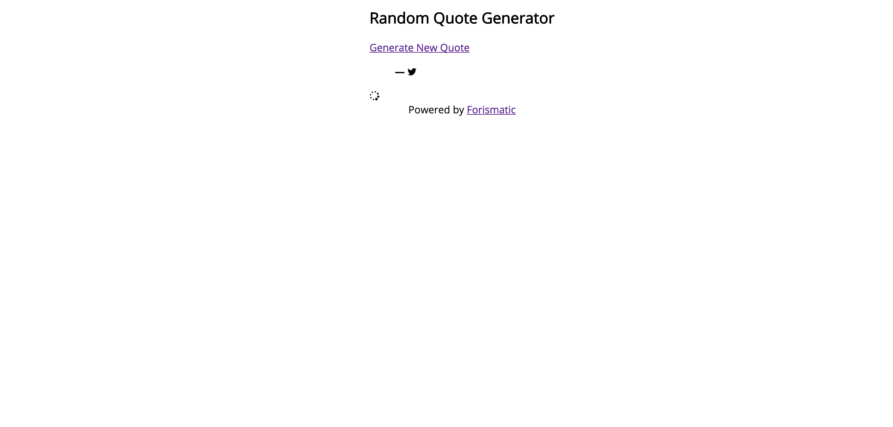
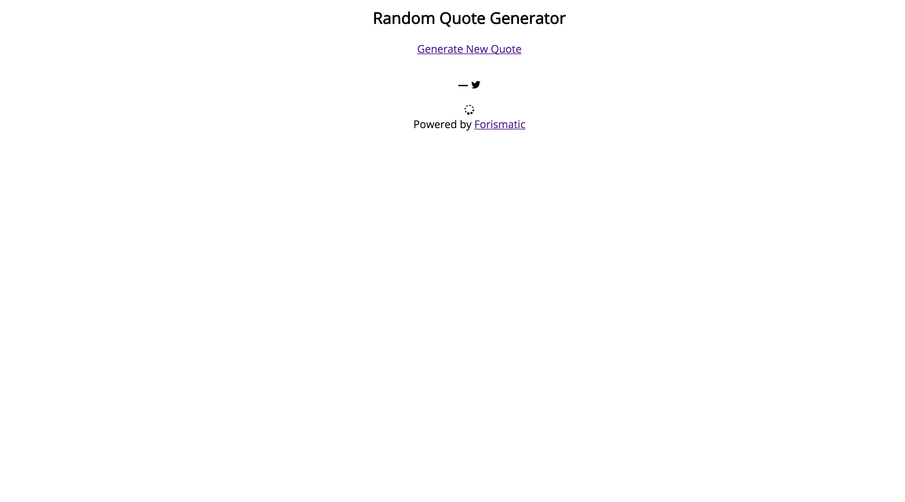
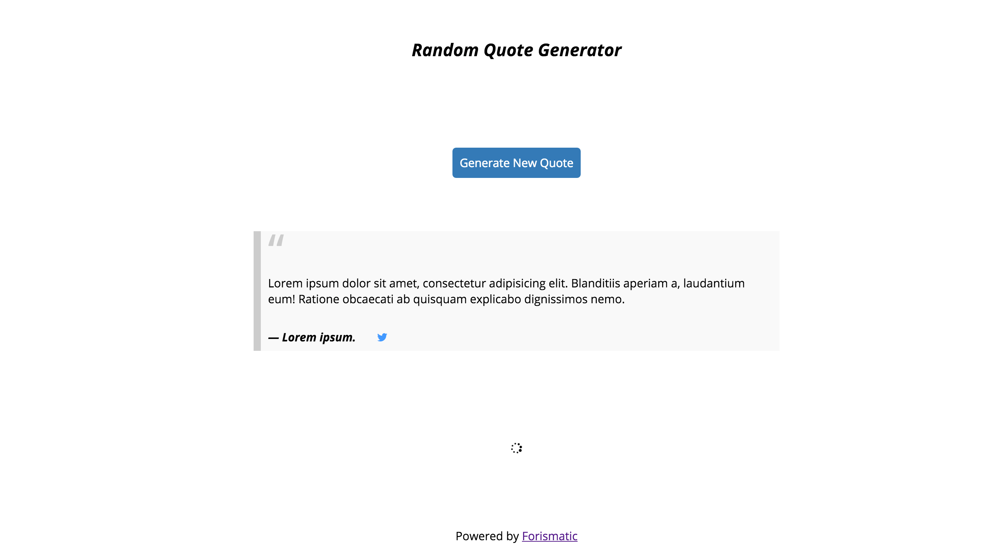
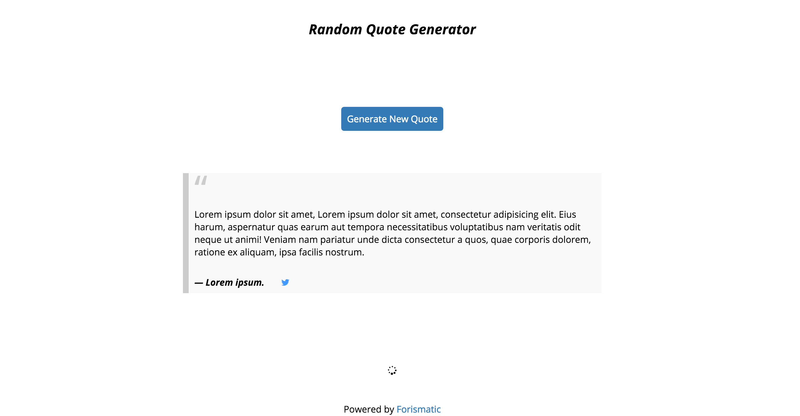
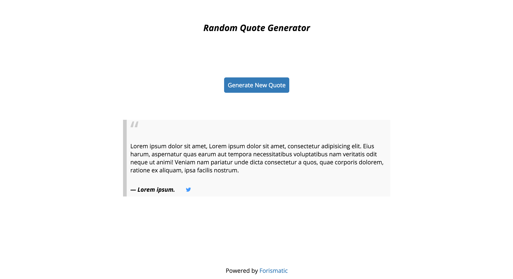

I decided to revisit a project I completed a while ago that displays a random quote from [Forismatic](http://forismatic.com/en/). This project is also part of the [Free Code Camp](http://freecodecamp.com/) curriculum that I have been completing in my spare time. I originally used [Bootstrap](http://getbootstrap.com/) to help with the layout of the page. I figured I would rewrite it without the help of a CSS framework to lean against, using flexbox. I have made a [codepen](http://codepen.io/krjordan/full/oXRQXG/) for anyone who wants to look at the finished product.

<!--more-->

### The HTML

So the HTML is easy and doesn't need much explanation. I am making use of the <code class="language-html">\<blockquote\></code> and <code class="language-html">\<cite\></code> tags to hold the quote and author. Here is the HTML:

```html
<body>
	<div class="container">
		<h2>Random Quote Generator</h2>
		<a
			href="#"
			id="btn-quote"
			>Generate New Quote</a
		>
		<blockquote>
			<p id="quoteText"></p>
			<cite
				>&mdash; <span id="quoteAuthor"></span>
				<span id="btn-tweet">
					<i class="fa fa-twitter"></i>
				</span>
			</cite>
		</blockquote>
		<div class="load"><i class="fa fa-spinner fa-spin"></i></div>
	</div>
	<footer>
		Powered by&nbsp;<a href="http://forismatic.com/en/">Forismatic</a>
	</footer>
</body>
```

It should also be noted that I'm using [Normalize.css](http://necolas.github.io/normalize.css/), [Font Awesome Icons](https://fortawesome.github.io/Font-Awesome/), [jQuery](https://jquery.com/) and [Google Fonts](https://www.google.com/fonts). Hence, the <code class="language-html">class="fa fa-twitter"</code> and <code class="bash">fa fa-spinner fa-spin</code>. Also, to make the loading icon spin, we add the <code class="bash">fa-spin</code> class.

With our HTML out of the way we can get into the good stuff! Our page looks pretty boring right now.


### Adding the CSS

So lets dig into the CSS and give the <code class="language-html">\<body\></code> some flexbox:

```css
body {
	display: flex;
	flex-direction: column;
	align-items: center;
	font-family: 'Open Sans', sans-serif;
}
```

This will center everything in our <code class="language-html">\<body\></code> and also set our font as Open Sans.


Now that the <code class="language-html">\<body\></code> is centered we will need to do the same to the <code class="bash">container</code> so all of the elements inside the <code class="bash">container</code> will be centered as well. We also need to make sure that <code class="language-css">flex-direction: column;</code> is set since <code class="language-css">flex-direction: row;</code> is the default and we want our content in a column.

```css
.container {
	display: flex;
	align-items: center;
	flex-direction: column;
}
```



I'm also going to add some Lorem ipsum in for the <code class="language-html">\<blockquote\></code> and <code class="language-html">\<cite\></code> tags to help us with styling. Now that we have everything centered, lets make it a bit more easy on the eyes.

```css
h2 {
	padding: 3.125em 0;
	font-weight: 700;
	font-style: italic;
}
p {
	max-width: 700px;
}
#btn-quote {
	padding: 0.625em;
	margin: 3.125em 0;
	background-color: #337ab7;
	color: #fff;
	text-decoration: none;
	border-radius: 5px;
}
#btn-quote:hover {
	background-color: #2e6da4;
}
/* Stolen from CSS-Tricks.com */
blockquote {
	background-color: #f9f9f9;
	border-left: 10px solid #ccc;
	margin: 1.5em 10px;
	padding: 0.5em 10px;
	quotes: '\201C''\201D''\2018''\2019';
}
blockquote:before {
	color: #ccc;
	content: open-quote;
	font-size: 4em;
	line-height: 0.1em;
	margin-right: 0.25em;
	vertical-align: -0.4em;
}
blockquote p,
blockquote span {
	padding: 0.938em 0;
}
#btn-tweet {
	padding-left: 1.563em;
	cursor: pointer;
	color: #4099ff;
}
#btn-tweet:hover {
	color: #0065d9;
}
.load {
	padding: 6.25em 0;
}
```



Looking good, but when the quote is bigger or smaller, the footer moves accordingly. That's not what we want. So lets make the footer stick to the bottom of the page.

```css
body {
  ... height: 100vh;
}
.container {
  ... flex: 1;
}
```


I snagged the <code class="language-html">\<blockquote\></code> styling from [CSS-Tricks](https://css-tricks.com/snippets/css/simple-and-nice-blockquote-styling/)

Now our footer stays at the bottom of the page even if the quote is one sentence long. The <code class="language-css">height: 100vh;</code> basically tells the browser to set the height to 100% of whatever height the viewport is. The <code class="language-css">flex: 1</code> tells the browser how much space the element should take up. Setting <code class="language-css">flex</code> to <code class="language-css">1</code> will tell the browser to make this element larger than its siblings since the default value is zero.

Lets style the <code class="language-html">\<footer\></code> and make the loading icon hidden for the time being.

```css
footer {
	padding: 0.938em;
}
footer a {
	text-decoration: none;
	color: #337ab7;
}
footer a:hover {
	color: #0065d9;
}
```

```javascript
$(document).ready(function () {
	// Hide the loading icon
	$('.load').hide()
})
```



This concludes the styling portion of this tutorial. I plan on writing up a <code class="bash">Part 2</code> that will walk through the jQuery code. If you have any questions or comments feel free to leave them below. If you want to view the finished page, you can find it [here](http://codepen.io/krjordan/full/oXRQXG/) and I have also added a [Github repo](https://github.com/krjordan/random-quote-generator) for those who would rather download the source code to play around with. The final code up to this point is below.

```html
<body>
	<div class="container">
		<h2>Random Quote Generator</h2>
		<a
			href="#"
			id="btn-quote"
			>Generate New Quote</a
		>
		<blockquote>
			<p id="quoteText">
				Lorem ipsum dolor sit amet, Lorem ipsum dolor sit amet, consectetur
				adipisicing elit. Eius harum, aspernatur quas earum aut tempora
				necessitatibus voluptatibus nam veritatis odit neque ut animi! Veniam
				nam pariatur unde dicta consectetur a quos, quae corporis dolorem,
				ratione ex aliquam, ipsa facilis nostrum.
			</p>
			<cite
				>&mdash; <span id="quoteAuthor">Lorem impsum.</span>
				<span id="btn-tweet">
					<i class="fa fa-twitter"></i>
				</span>
			</cite>
		</blockquote>
		<div class="load"><i class="fa fa-spinner fa-spin"></i></div>
	</div>
	<footer>
		Powered by&nbsp;<a href="http://forismatic.com/en/">Forismatic</a>
	</footer>
</body>
```

```css
body {
	display: flex;
	flex-direction: column;
	align-items: center;
	height: 100vh;
	font-family: 'Open Sans', sans-serif;
}
.container {
	display: flex;
	align-items: center;
	flex-direction: column;
	flex: 1;
}
h2 {
	padding: 3.125em 0;
	font-weight: 700;
	font-style: italic;
}
p {
	max-width: 43.75em;
}
#btn-quote {
	padding: 0.625em;
	margin: 3.125em 0;
	background-color: #337ab7;
	color: #fff;
	text-decoration: none;
	border-radius: 5px;
}
#btn-quote:hover {
	background-color: #2e6da4;
}
blockquote {
	background-color: #f9f9f9;
	border-left: 10px solid #ccc;
	margin: 1.5em 10px;
	padding: 0.5em 10px;
	quotes: '\201C''\201D''\2018''\2019';
}
blockquote:before {
	color: #ccc;
	content: open-quote;
	font-size: 4em;
	line-height: 0.1em;
	margin-right: 0.25em;
	vertical-align: -0.4em;
}
blockquote p,
blockquote span {
	padding: 0.938em 0;
}
#btn-tweet {
	padding-left: 1.563em;
	cursor: pointer;
	color: #4099ff;
}
#btn-tweet:hover {
	color: #0065d9;
}
.load {
	padding: 6.25em 0;
}
footer {
	padding: 0.938em;
}
footer a {
	text-decoration: none;
	color: #337ab7;
}
footer a:hover {
	color: #0065d9;
}
```

```javascript
$(document).ready(function () {
	// Hide the loading icon
	$('.load').hide()
})
```
