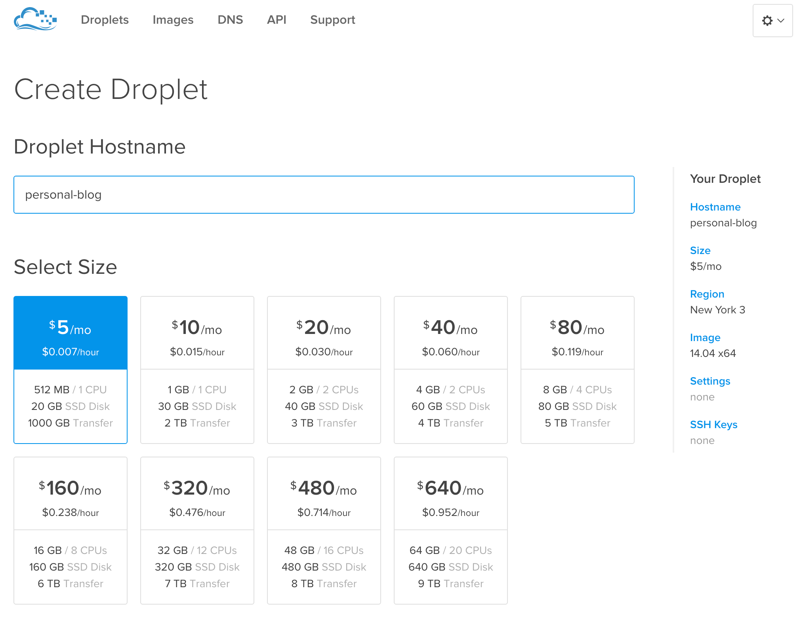
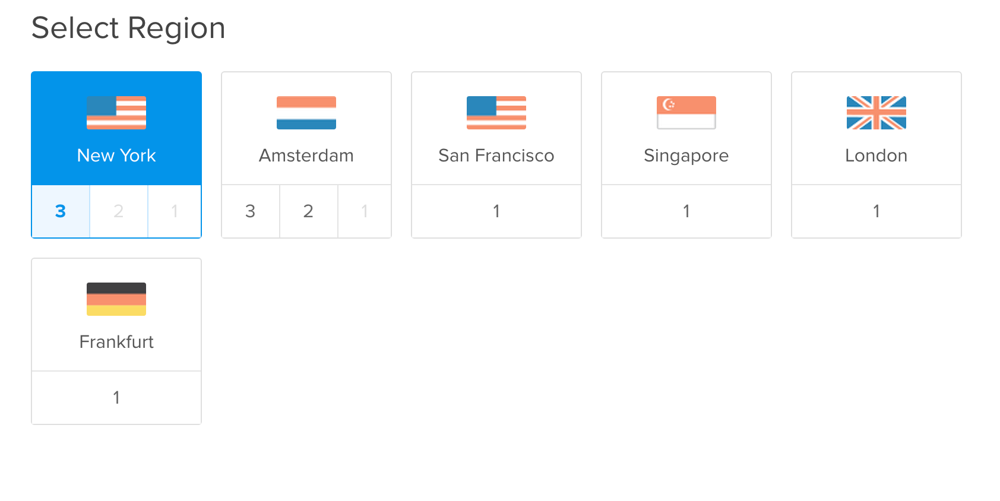
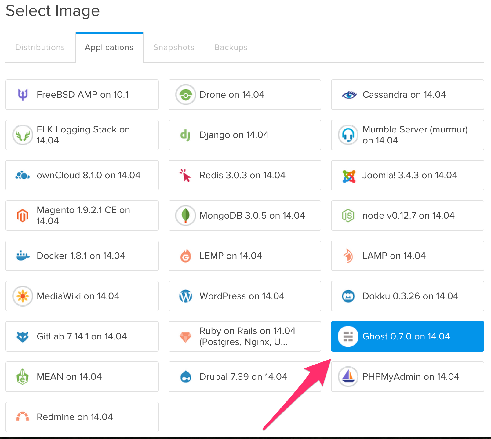

I know there are numerous tutorials on how to setup Ghost with Digital Ocean, but I figured I'd throw mine into the hat. This will be a quick and to the point tutorial of how to get your start a Ghost blog with Digital Ocean.

First, a quick introduction to [Ghost](https://ghost.org) and [Digital Ocean](https://www.digitalocean.com/). Ghost is an open source blogging platform that is easy to get up and running. It functions like a CMS and your posts are written in Markdown. Digital Ocean is a cloud hosting provider. They offer good prices and have a good deal of tutorials to help you get up and running. I'll be honest, it took me a few days of research and playing around to get one of my sites up and running as I had only used GoDaddy before. So knowing your way around the terminal helps, but isn't required for this tutorial.

<!--more-->

And so it begins...

## Creating A Droplet

You will need an account at Digital Ocean and then you will need to create a droplet. Fill in whatever you want to call your droplet for your Droplet Hostname and then select a size. I'm currently using the 512 MB for this blog.



Select where you want your droplet hosted. I live in the U.S., so naturally, I chose one close to me.



Now select the Ghost image.



Next you will need to choose any additional settings like backups and private networking. I'm didn't select any. Backups might not be a bad idea, though...

Optionally, you can add you ssh key to use when logging into the droplet instead of a password. If you would like to use an ssh key and you have one on your Mac simply open your terminal and type <code class="bash">pbcopy < ~/.ssh/id_rsa.pub</code> to copy it to your clipboard. Then add it by using <code class="bash">cmd v</code> or right click <code class="bash">paste</code>. If you do not have an ssh key, a good tutorial can be found on Github [here](https://help.github.com/articles/generating-ssh-keys/).

Now you are ready to create your droplet. This will take a minute or so, then you will receive an email containing all of the important information about your new droplet.

## Configure Your Nameservers

If you haven't done so already, you will need to point your nameservers from your domain registrar to Digital Ocean. For more info, check out [Digital Ocean's instructions](https://www.digitalocean.com/community/tutorials/how-to-set-up-a-host-name-with-digitalocean).

## Your New Blog

Now you can navigate to the IP address given to you from Digital Ocean and you should see your new blog. To log in, type <code class="bash">123.45.678.90/ghost</code> in the address bar, replacing the example IP with your IP. This should take you to a signup form where you will need to fill out your information. This information is strictly for this droplet so that you can log in and edit/publish to your blog. Once that's complete, you should be logged in.

## Set up a Domain Name

To log into my droplets, I use my terminal. You can also use the console on Digital Ocean, but I find my terminal more cooperative and only use the console they provide when/if something happens. Like banning my IP address when testing out flightplan.js while using fail2ban. That was a frustrating experience.

At any rate, open your terminal and and log in to your droplet. To do this type <code class="bash">ssh root@123.45.678.90</code> again, using your IP address instead of the one here. If you chose to use an ssh key, you will automatically be logged in. If not, you will be prompted for a password. This password will be the same one you received from Digital Ocean in your email.

If you're not that familiar with the terminal, when you type or paste your password into the terminal, it will not provide any feedback for security purposes. Just press enter. Once in, it will ask you again for the password. Then it will ask for a new password that you will need to input twice.

Now, you will need to open the nginx configuration file and edit the server_name. Type <code class="bash">vi /etc/nginx/sites-available/ghost</code> . Below is what the file should look like. You will need to change the <code class="bash">my-ghost-blog.com</code> value to your domain name.

```nginx
server {
    listen 80;
    server_name my-ghost-blog.com ;

    location / {
        proxy_pass http://localhost:2368/;
        proxy_set_header Host $host;
        proxy_buffering off;
    }
}
```

After changing the value of <code class="language-nginx">server_name</code> to your domain name, press the <code class="bash">esc</code> key and then type <code class="bash">:wq</code> to save and quit vi.

You will now need to edit the <code class="bash">config.js</code> file. Type <code class="bash">vi /var/www/ghost/config.js</code> to open the file. You should now see

```nginx
// # Ghost Configuration
// Setup your Ghost install for various [environments](http://support.ghost.org/config#about-environments).

// Ghost runs in 'development' mode by default. Full documentation can be found at http://support.ghost.org/config/

var path= require('path'),
    config;

config = {
    // ## Production
    // When running Ghost in the wild, use the production environment.
    // Configure your URL and mail settings here
    production: {
        url: 'http://my-ghost-blog.com',
        mail: {},
        database: {
            client: 'sqlite3',
            connection: {
                filename: path.join(__dirnam, '/content/data/ghost.db')
            },
            debug: false
        },

        server: {
```

You will need to change the <code class="language-javascript">url: 'http://my-ghost-blog.com'</code> to <code class="language-javascript">url: 'http://YOUR-DOMAIN.com'</code> in the <code class="bash">production</code> block. Again, after editing the file press the <code class="bash">esc</code> key and the type <code class="bash">:wq</code> to save and quit the text editor.

Finally, you will need to restart Ghost with <code class="language-nginx">service ghost restart</code> for the changes to be applied. There are other options that you can configure in this file. Visit the [Ghost Documentation](https://support.ghost.org/config/).

## Conclusion

Now you are ready to publish your first blog post! This tutorial turned out longer than I had originally planned. However, hopefully it will help you quickly set up Ghost with Digital Ocean. If you run into any issues, there are numerous tutorials from Digital Ocean and in the support documentation at https://support.ghost.org. Feel free to leave a comment or any questions you may have below.
